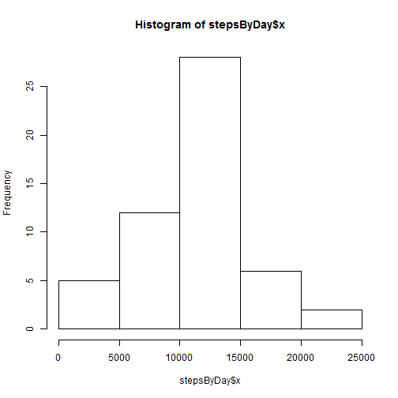
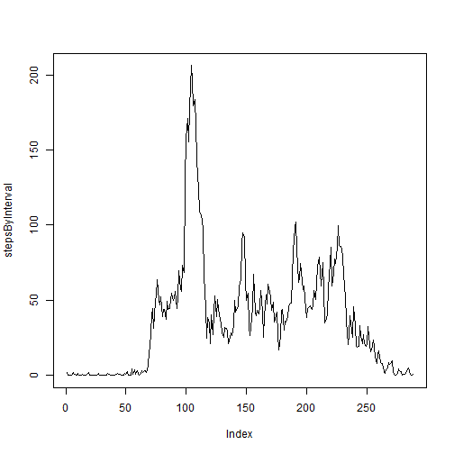
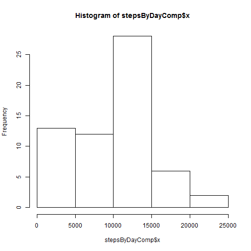
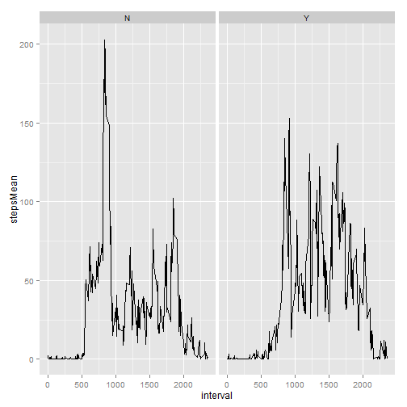

Assignment 1 
Pablo Tercero
========================================================

This is the R Markdown document for Assignment 1 on Reproducible Research's coursera course.I present below the steps taken to produce the answer to the assignment questions:

**Loading the data**
First I loaded the data and looked at the nature of the data


```r
actDat <- read.csv("activity.csv",header = TRUE)
head(actDat)
```

```
##   steps       date interval
## 1    NA 2012-10-01        0
## 2    NA 2012-10-01        5
## 3    NA 2012-10-01       10
## 4    NA 2012-10-01       15
## 5    NA 2012-10-01       20
## 6    NA 2012-10-01       25
```

```r
str(actDat)
```

```
## 'data.frame':	17568 obs. of  3 variables:
##  $ steps   : int  NA NA NA NA NA NA NA NA NA NA ...
##  $ date    : Factor w/ 61 levels "2012-10-01","2012-10-02",..: 1 1 1 1 1 1 1 1 1 1 ...
##  $ interval: int  0 5 10 15 20 25 30 35 40 45 ...
```

```
Then 1st question:
**What is mean total number of steps taken per day?**

First I aggregate the data by date getting the total steps by date and then I plot them 
To get the mean and median I use summary

```r
stepsByDay <- with(actDat,aggregate(steps,by=list(date),FUN="sum"))
hist(stepsByDay$x)
```

 

```r
summary(stepsByDay$x)
```

```
##    Min. 1st Qu.  Median    Mean 3rd Qu.    Max.    NA's 
##      41    8841   10760   10770   13290   21190       8
```

**What is the average daily activity pattern?**
I use tapply to get the mean steps by interval and then I plot using line (type='l')
The max is obtained with which.max


```r
stepsByInterval <- tapply(actDat$steps,actDat$interval,mean,na.rm=TRUE)
plot(stepsByInterval,type = 'l')
```

 

```r
which.max(stepsByInterval) #it's interval 104
```

```
## 835 
## 104
```

**Imputing missing values**
This took a while but doing some reseach I found an R-bloggers post about this great process/tool for imputing missing data
http://www.r-bloggers.com/imputing-missing-data-with-r-mice-package/

I loaded the necessary library and followed steps to get the # of NAs 
These can also be obtained with 

```r
summary(actDat)
```

```
##      steps                date          interval     
##  Min.   :  0.00   2012-10-01:  288   Min.   :   0.0  
##  1st Qu.:  0.00   2012-10-02:  288   1st Qu.: 588.8  
##  Median :  0.00   2012-10-03:  288   Median :1177.5  
##  Mean   : 37.38   2012-10-04:  288   Mean   :1177.5  
##  3rd Qu.: 12.00   2012-10-05:  288   3rd Qu.:1766.2  
##  Max.   :806.00   2012-10-06:  288   Max.   :2355.0  
##  NA's   :2304     (Other)   :15840
```
that gave us 2304 NAs, but the package was really useful to find a method to impute values for NAs

```r
library(mice)
```

```
## Loading required package: Rcpp
## Loading required package: lattice
## mice 2.22 2014-06-10
```

```r
md.pattern(actDat)
```

```
##       date interval steps     
## 15264    1        1     1    0
##  2304    1        1     0    1
##          0        0  2304 2304
```

The method is mice , it uses method pmm (predictive mean matching) but there are other methods
There's a nice paper at : http://www.stefvanbuuren.nl/publications/MICE%20in%20R%20-%20Draft.pdf
(the code took a long time to evaluate so I only use 2 iterations in this file but I used 50 to run my own code , tests , the more iterations the better)

```r
tempData <- mice(actDat,maxit = 2,method = 'pmm',seed = 500)
```

```
## 
##  iter imp variable
##   1   1  steps
##   1   2  steps
##   1   3  steps
##   1   4  steps
##   1   5  steps
##   2   1  steps
##   2   2  steps
##   2   3  steps
##   2   4  steps
##   2   5  steps
```

```r
summary(tempData)
```

```
## Multiply imputed data set
## Call:
## mice(data = actDat, method = "pmm", maxit = 2, seed = 500)
## Number of multiple imputations:  5
## Missing cells per column:
##    steps     date interval 
##     2304        0        0 
## Imputation methods:
##    steps     date interval 
##    "pmm"    "pmm"    "pmm" 
## VisitSequence:
## steps 
##     1 
## PredictorMatrix:
##          steps date interval
## steps        0    1        1
## date         0    0        0
## interval     0    0        0
## Random generator seed value:  500
```
tempData$imp$steps shows the steps and results for each iteration, I don't ouput that either


```r
completeData <- complete(tempData,1)
head(completeData)
```

```
##   steps       date interval
## 1     0 2012-10-01        0
## 2     0 2012-10-01        5
## 3     0 2012-10-01       10
## 4     0 2012-10-01       15
## 5     0 2012-10-01       20
## 6     0 2012-10-01       25
```

completeData now has all of the data without the NAs and is the new data set to compare with the set with NAs

Using the exact same code with a different data set , I get the plot and the mean,median


```r
stepsByDayComp <- with(completeData,aggregate(steps,by=list(date),FUN="sum"))
hist(stepsByDayComp$x)
```

 

```r
summary(stepsByDayComp$x)
```

```
##    Min. 1st Qu.  Median    Mean 3rd Qu.    Max. 
##      41    6778   10400    9435   12810   21190
```

**Are there differences in activity patterns between weekdays and weekends?**

 I noticed that the date field needs to be converted to data , so I use lubridate to convert

```r
library(lubridate)
actDat$date <- ymd(actDat$date)
```

The steps below accomplish the following 
1. I get a new data set to manipulate the data , create weekend info etc
2. I create two new columns 
  + WeekD is the weekday based on the date info 
  + Weekend which is a Y for weekend, N for "weekday"" based on what weekday(the variable) is
3. I find the mean steps for each interval  for weekend and weekdays
4. I rename the columns of the data frame (obtained with aggregate , mean) with better names

I do head and tail of the data sets created to check if the variables were added correctly


```r
complDat <- completeData
complDat$WeekD <- weekdays(ymd(complDat$date))
complDat$Weekend = ifelse(complDat$WeekD %in% c("Saturday","Sunday"),"Y","N")
head(complDat)
```

```
##   steps       date interval  WeekD Weekend
## 1     0 2012-10-01        0 Monday       N
## 2     0 2012-10-01        5 Monday       N
## 3     0 2012-10-01       10 Monday       N
## 4     0 2012-10-01       15 Monday       N
## 5     0 2012-10-01       20 Monday       N
## 6     0 2012-10-01       25 Monday       N
```

```r
tail(complDat)
```

```
##       steps       date interval  WeekD Weekend
## 17563    45 2012-11-30     2330 Friday       N
## 17564     0 2012-11-30     2335 Friday       N
## 17565     0 2012-11-30     2340 Friday       N
## 17566     0 2012-11-30     2345 Friday       N
## 17567     0 2012-11-30     2350 Friday       N
## 17568     0 2012-11-30     2355 Friday       N
```

```r
complstepsByIntervalAgg <- aggregate(complDat$steps,list(complDat$interval,as.factor(complDat$Weekend)),mean,na.rm=TRUE)
colnames(complstepsByIntervalAgg) <- c('interval','Weekend','stepsMean')
head(complstepsByIntervalAgg)
```

```
##   interval Weekend  stepsMean
## 1        0       N 2.02222222
## 2        5       N 0.40000000
## 3       10       N 0.15555556
## 4       15       N 0.17777778
## 5       20       N 0.08888889
## 6       25       N 1.31111111
```

```r
tail(complstepsByIntervalAgg)
```

```
##     interval Weekend stepsMean
## 571     2330       Y    1.0625
## 572     2335       Y   11.0000
## 573     2340       Y    5.8750
## 574     2345       Y    3.7500
## 575     2350       Y    0.0000
## 576     2355       Y    0.0000
```

Finally I make a ggplot (line plot) with facets to represent the difference in mean steps on weekdays and weekends

```r
library(ggplot2)
ggplot(complstepsByIntervalAgg,aes(interval,stepsMean))+geom_line()+facet_grid(.~Weekend)
```

 

This completes the assignment
